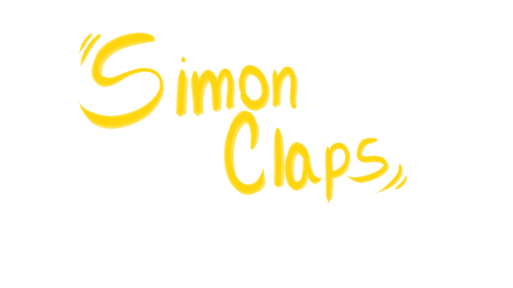

# 🎮 Unijam 2025 – *Simon Claps*  

Vous êtes confortablement installé dans le public… ou du moins, vous le croyez.  
Simon défile une série de diapositives, et chacune renferme une **règle secrète** que vous devez suivre. À vous de rester attentif et de **réagir correctement** pour gagner le respect du public.  

Mais attention : **manquez un signal**, et la salle entière se retourne contre vous.  
Saurez-vous garder votre sang-froid, déchiffrer les attentes du public et **survivre à la présentation** ?

## 🕹️ Concept du jeu
- Chaque diapositive affiche une règle implicite.
- Réalisez la bonne action au bon moment.
- Le public réagit immédiatement à vos erreurs… ou à vos réussites.
- Un jeu d’observation, de timing et de pression psychologique.

## 👥 Équipe de développement

**Crédits :**
- Sarah SIM
- Mathieu BONTEMPS
- Lara VENTURA
- Farès GATI
- Aurélie WAGNER
- Amazigh HALIL
- - Arthur PINEL
